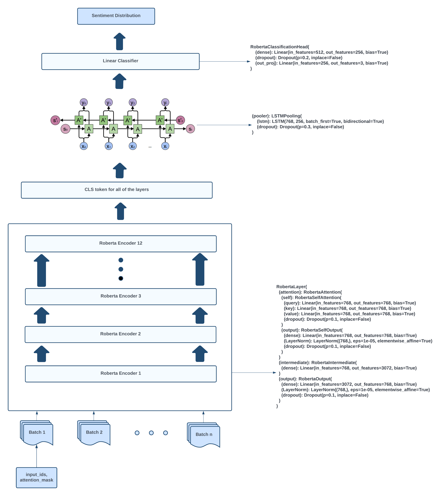

## Exploring the Impact of Different Pooling Methods on XLM-RoBERTa

## Project structure
```bash
.
├── config                      
│   ├── main.yaml                   # Main configuration file
│   ├── model                       # Configurations for training model
│   │   ├── model1.yaml             # First variation of parameters to train model
│   │   └── model2.yaml             # Second variation of parameters to train model
│   └── process                     # Configurations for processing data
│       ├── process1.yaml           # First variation of parameters to process data
│       └── process2.yaml           # Second variation of parameters to process data
├── docs                            # documentation for your project
├── dvc.yaml                        # DVC pipeline
├── .flake8                         # configuration for flake8 - a Python formatter tool
├── .gitignore                      # ignore files that cannot commit to Git
├── Makefile                        # store useful commands to set up the environment
├── pyproject.toml                  # dependencies for poetry
├── README.md                       # describe your project
├── src                             # store source code
│   ├── __init__.py                 # make src a Python module 
│   ├── data_batcher.py             # process data before training model
│   └── data_loader.py              # batch the dataset
│   └── evaluate.py                 # evaluating during training
│   └── inference.py                # inference script
│   └── main.py                     # trainer class
│   └── model.py                    # model architecure
│   └── pretrainedModel.py          # download/load pretrained model 
│   └── train_utils.py              # train and evluate model
│   └── train.py                    # parse paramters to train
│   └── train.sh                    # parse paramters to train
│   └── utils.py                    # utils to train
│   └── visualize.py                # visualize weights for each epoch

```


## Architecure



## 🧩 Features

|    |   Feature         | Description |
|----|-------------------|---------------------------------------------------------------|
| ⚙️  | **Architecture**  | The project leverages a Python 3.10 environment, utilizing the huggingface package for model training |
| 🔩 | **Code Quality**  | The codebase follows best practices with automated testing |
| 📄 | **Documentation** | [Medium Article](https://medium.com/@eaintthetrsc/tapping-into-xlm-robertas-hidden-potential-14e18a65b8b8)|
| 🧩 | **Modularity**    | The codebase is modular with abstract factory modules for data loading, model creating, training and testing, even for inference for single testing|
| 🧪 | **Testing**       | src/inference.py |
| 📦 | **Dependencies**  | Key dependencies include Python, HuggingFace and CUML |


## 🚀 Getting Started
### 🤖 Usage

<h4>From <code>source</code></h4>

### 🤖 Models

> Model Architecture Detail
> ```console
>  check on src/model.py
> ```

### 🚀 Train
> Train
> ```console
> $ bash src/train.sh
> ```

### 🧪 Tests

> Test
> ```console
> $ python src/inference.py
> ```


## 🤝 Contributing

- **[Report Issues](https://github.com/rsceth/Language-Model-Pooling-Exploration/issues)**: Submit bugs found or log feature requests.


## 📄 License

This project is protected under the [LICENSE](LICENSE) file.